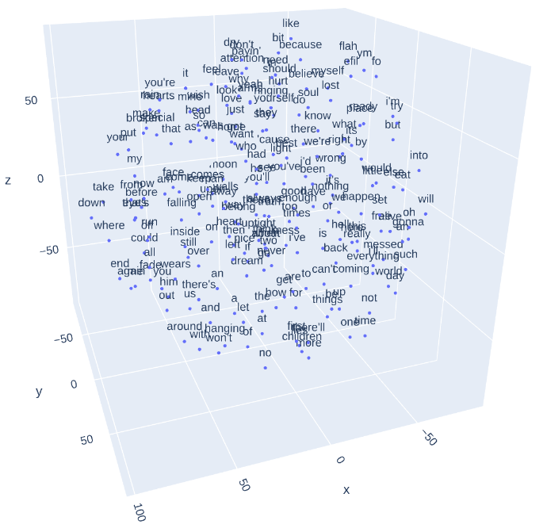
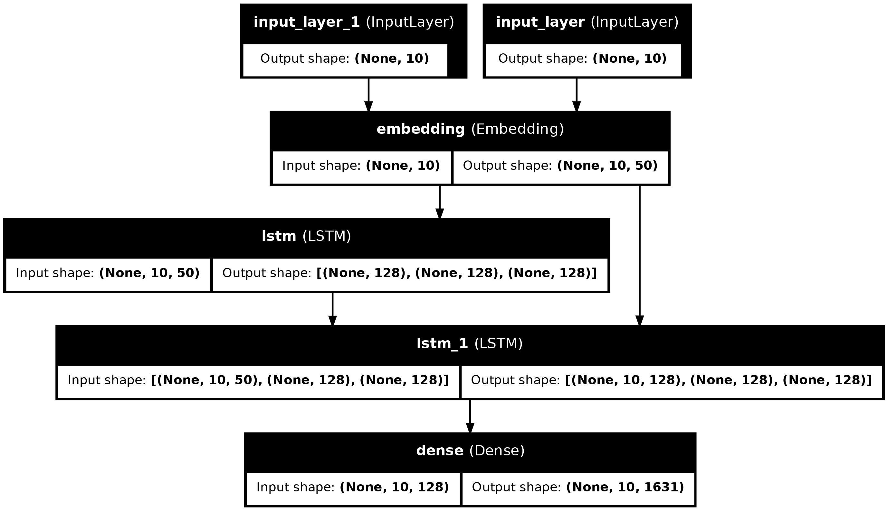

# Procesamiento del Lenguaje Natural

## Resumen

Este repositorio contiene los trabajos realizados en el marco de la materia de Procesamiento del Lenguaje Natural (NLP). A lo largo del curso, cubrimos un amplio espectro de temas relacionados con NLP, desde los fundamentos como la tokenización, pasando por análisis sintáctico y semántico, hasta modelos avanzados como transformers y Large Language Models (LLMs).

Cada desafío en este repositorio representa un proyecto práctico que aplica los conceptos y técnicas aprendidas en la materia.

## Desafío 1: [Vectorización de Texto y Clasificación con Naïve Bayes]

**Resumen**:  
En este desafío, se exploró el uso de técnicas de vectorización de texto para transformar datos textuales en representaciones numéricas, lo que es crucial para aplicar modelos de aprendizaje automático. Se utilizaron dos enfoques de vectorización: Count Vectorizer y TF-IDF Vectorizer, para convertir el texto del dataset 20 newsgroups en vectores de características. Posteriormente, se implementó un modelo de clasificación Naïve Bayes (Multinomial y Complement Naïve Bayes) para categorizar los documentos en las diferentes categorías temáticas presentes en el dataset. Finalmente, se evaluó el rendimiento del modelo utilizando la métrica de F1-score.

## Desafío 2: [Creación de Word Embeddings con Word2Vec en Canciones]

**Resumen**:  
En este desafío, se trabajó con un conjunto de datos de letras de canciones para entrenar un modelo de Word2Vec, una técnica de aprendizaje profundo que permite capturar relaciones semánticas entre palabras mediante la creación de embeddings de palabras. Se procesaron y prepararon los datos, y se utilizó el modelo Word2Vec para generar representaciones vectoriales de palabras. Estas representaciones permiten analizar y visualizar relaciones semánticas, identificando patrones de similitud y diferencias entre palabras dentro del contexto de las letras de canciones.

## Desafío 3: [Modelos de Lenguaje con Tokenización por Caracteres y Palabras]

**Resumen**:  
En este desafío, se abordaron dos enfoques distintos para la creación de modelos de lenguaje: uno basado en la tokenización por caracteres y otro en la tokenización por palabras. Se seleccionó un corpus de texto sobre el cual se entrenaron ambos modelos. Se llevaron a cabo procesos de pre-procesamiento específicos para cada tipo de tokenización, estructurando los datasets y separándolos en datos de entrenamiento y validación. Para ambos enfoques, se propusieron y evaluaron arquitecturas de redes neuronales basadas en unidades recurrentes, como LSTM o GRU, con el objetivo de generar nuevas secuencias de texto a partir de secuencias de contexto. Se implementaron estrategias de generación de texto, como greedy search y beam search, observando el impacto de la temperatura en la variabilidad de las secuencias generadas. Los modelos fueron evaluados utilizando métricas como la perplejidad para guiar el proceso de entrenamiento y ajuste de hiperparámetros. ​​

## Desafío 4: [Título del Desafío 4]

**Resumen**:  
En este desafío, se desarrolló un bot de preguntas y respuestas (QA) utilizando datos del challenge ConvAI2, enfocado en conversaciones en inglés. El proceso comenzó con el preprocesamiento del corpus, donde se realizaron las transformaciones necesarias para generar secuencias de entrada y salida, así como la codificación de palabras mediante índices. Se prepararon embeddings preentrenados, como Glove o FastText, para convertir los tokens de entrada en vectores. A continuación, se entrenó un modelo basado en la arquitectura encoder-decoder, utilizando LSTM para manejar las secuencias. Finalmente, se evaluó la capacidad del bot para responder preguntas basadas en las secuencias de contexto proporcionadas, afinando el modelo para mejorar su precisión en la generación de respuestas coherentes y contextualmente relevantes.

## Desafío 5: [Analisis de Sentimiento con Bert]

**Resumen**:  
En este ejercicio se trabajo en analisis de sentimiento usando embeddings de BERT, primero entrenando con tres clases y luego con 5. No se realizo fine tunning de los embeddings debido a que esto requeria un mayor nivel de recursos computacionales.
